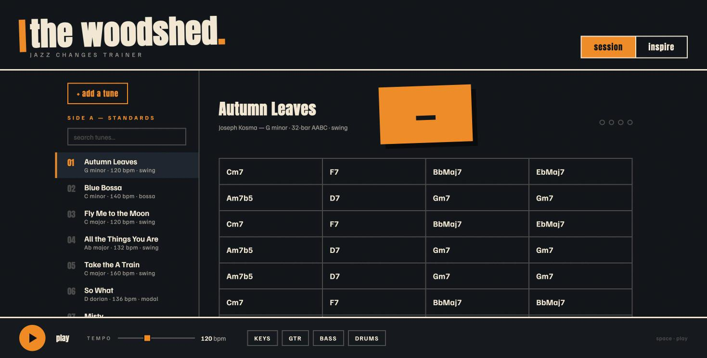

# the woodshed 🎷

**Practice jazz standards with a full backing band, right in your browser.**

**▶ [Try it live](https://tubaxenor.github.io/chord_practice/)** — no install, no login, no build step.



A rhythm section (sampled piano, guitar, bass + synthesized drums) loops classic jazz standards while you practice. The lead sheet follows along, every chord shows its recommended solo scale, and an optional generated soloist demonstrates lines over the changes.

## Features

- **20-ish classic standards** — swing, bossa, ballad, blues, modal, funk — each with chord changes cross-checked against at least two jazz-education sources (cited per song, in-app and in `js/songs.js`)
- **Session mode** — the band loops the tune; the lead sheet highlights the current bar and a solo-notes strip shows the 8-note chord scale to improvise with (e.g. `Dm7 → D dorian`), roots highlighted
- **Inspire mode** — a generated piano soloist improvises over the changes: dynamic intensity arc per chorus, phrase flavors (runs, long tones, bluesy riffs), motif echoes, bebop enclosures, blue notes. Two live dials — **crowding** (note packing) and **loudness** (velocity/articulation) — reshape the line mid-tune. A rolling feed shows the last 4 bars the soloist played
- **Style-aware band** — walking bass + Freddie Green guitar + swung ride for swing; clave and syncopated patterns for bossa; brushes for ballads; backbeat for funk. Patterns vary per bar and per play
- **In-app song editor** — type changes in a simple bar syntax, preview with the full band, export JSON (or re-import previously exported JSON)
- **Type-to-search** songbook, tempo control, per-instrument mutes

## Quick start

**Use it online:** [tubaxenor.github.io/chord_practice](https://tubaxenor.github.io/chord_practice/)

**Run locally:**

```sh
git clone https://github.com/tubaxenor/chord_practice.git
cd chord_practice
python3 -m http.server 8000   # any static server works
# open http://localhost:8000
```

ES modules require http — opening `index.html` via `file://` won't work.

**Deploy your own:** fork → repo Settings → Pages → deploy from branch `main`, folder `/ (root)`. Everything is static files; samples and libraries load from public CDNs.

## Contributing a tune

The easiest path is the in-app editor:

1. Click **+ add a tune**, enter the metadata and the changes:
   - bars separated by `|`, chords in a bar by spaces
   - uneven splits with `:beats` — e.g. `Dm7b5:3 G7:1`
2. **Preview in player** to hear it with the full band.
3. **Export JSON**, then paste the object into [`js/songs.js`](js/songs.js) (before the closing `];`) and open a pull request.

Song object shape:

```js
{
  title: "My Tune",
  composer: "Somebody",
  key: "F major",
  bpm: 132,
  style: "swing",        // swing | bossa | ballad | blues | modal | latin | funk
  timeSignature: 4,      // beats per bar (3 for waltz)
  form: "32-bar AABA",
  source: ["https://…"], // where the changes were verified — please include
  note: "…",             // optional: known chart variants
  progression: [
    [{ chord: "Gm7", beats: 2 }, { chord: "C7", beats: 2 }],
    [{ chord: "FMaj7", beats: 4 }],
    // beats in each bar must sum to timeSignature
  ],
}
```

PR guidelines: verify the changes against at least two independent sources and list them in `source`; chord symbols only — no melodies or lyrics (see [Sources & legal](#sources--legal)). Supported symbols: the usual jazz vocabulary (`Maj7`, `m7`, `7b9`, `7#11`, `m7b5`, `dim7`, `alt`, `sus`, `6`, `69`, slash chords…) — unknown suffixes degrade to the closest known quality with a console warning.

Bug reports and feature ideas are welcome as issues.

## How it works

| Piece | Choice | Why |
|---|---|---|
| Scheduling | [Tone.js](https://tonejs.github.io/) | Transport with native swing, BPM ramps, looping, lookahead scheduling on the Web Audio clock |
| Band instruments | [smplr](https://github.com/danigb/smplr) + MusyngKite soundfonts | Real sampled piano/bass/guitar from a CDN, browser-cached |
| Solo piano | smplr's Splendid Grand | Multi-velocity Steinway samples |
| Drums | Tone.js synths | Instant start, zero assets to host |
| Theory | `js/theory.js` (zero-dep) | Chord-symbol parser, guide-tone voicings, chord-scale mapping, walking-bass helpers |

No framework, no bundler — plain ES modules (`js/band.js` is the band engine, `js/main.js` the UI, `js/songs.js` the songbook).

## Sources & legal

- **Included:** chord symbols, song titles, composer names, form/tempo metadata. Progressions follow common lead-sheet practice as taught by jazz-education sources (per-song URLs in `js/songs.js`, shown in-app).
- **Deliberately not included:** melodies, lyrics, published lead-sheet layouts, or recordings — the copyrighted elements of these songs.
- **Samples:** [MusyngKite soundfont kit](https://github.com/gleitz/midi-js-soundfonts) (CC BY-SA 3.0) and smplr's Splendid Grand Piano, via [smplr](https://github.com/danigb/smplr) (MIT). Scheduling by [Tone.js](https://tonejs.github.io/) (MIT).
- **Purpose:** personal practice and music education. This is a good-faith educational project, not legal advice; consult a music-licensing professional before commercializing anything derived from it.

## License

[GPLv3](LICENSE)
